# 角色与武功配置

## 角色列表

---

### 1. 乔峰 - 丐帮帮主
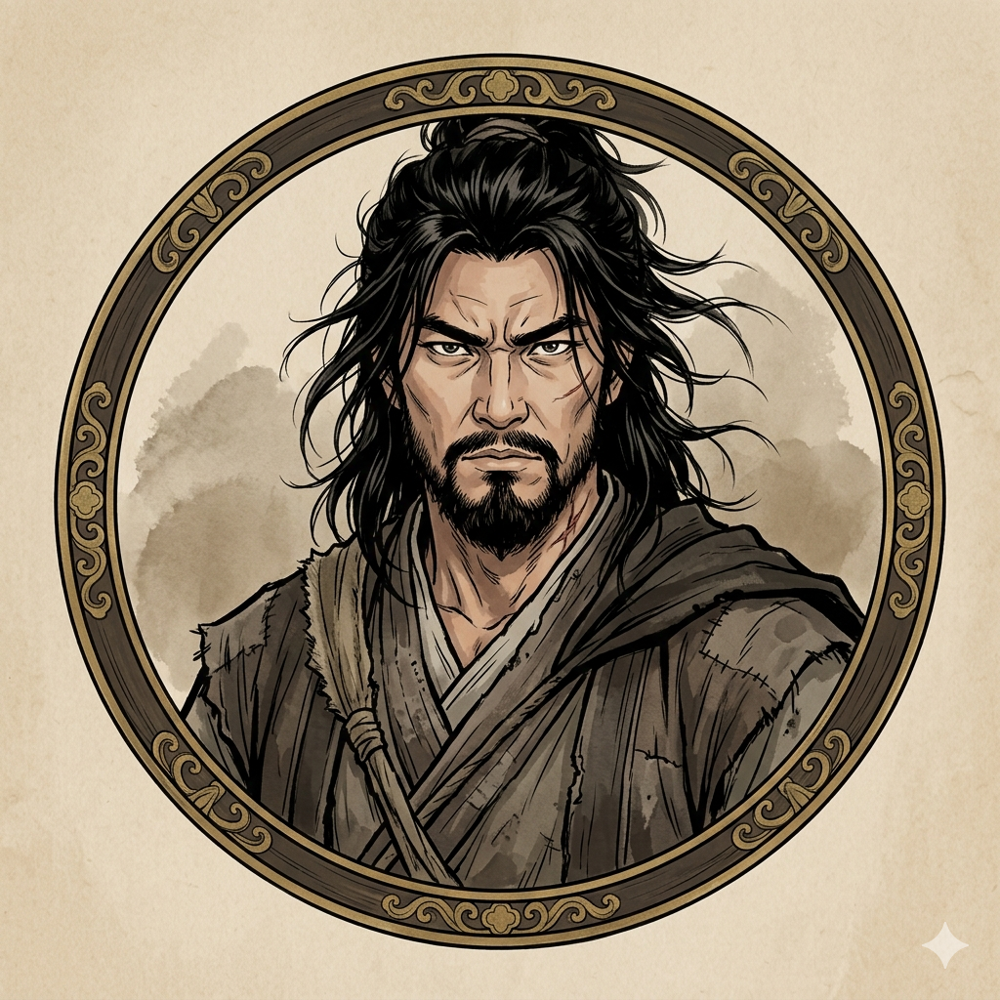

**出自**：《天龙八部》

| 属性 | 值 |
|------|-----|
| 体力 | 70 |
| 内力 | 20 |
| 轻功 | 10 |

**武功一：降龙掌**
- 武功招式：降龙十八掌（空手，消耗4内力，造成10点伤害）
- 内功：无

**武功二：打狗棒法**
- 武功招式：打狗棒法（长兵，消耗4内力，造成7点伤害，对方下回合无法使用腿法）
- 内功：无

**卡组**（20张）：
- 拳击×4, 掌击×5, 肘击×3
- 横扫×4, 直刺×2
- 前踢×2

---

### 2. 段誉 - 大理世子
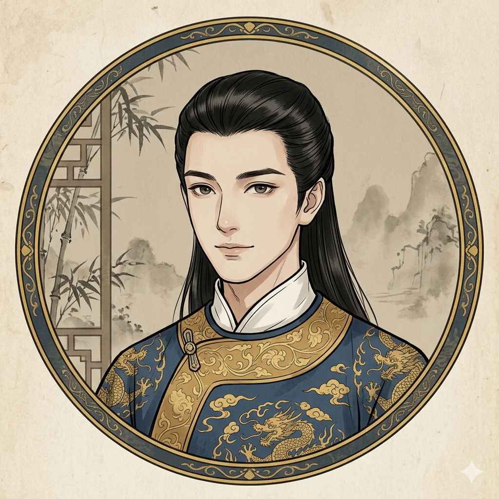

**出自**：《天龙八部》

| 属性 | 值 |
|------|-----|
| 体力 | 50 |
| 内力 | 30 |
| 轻功 | 14 |

**武功一：六脉神剑**
- 武功招式：六脉神剑（空手，消耗5内力，造成12点伤害，无视护盾）
- 内功：无

**武功二：凌波微步**
- 武功招式：无
- 内功：凌波微步（每回合开始25%几率闪避下一次攻击，初始轻功+3，每回合轻功+1）

**武功三：北冥神功**
- 武功招式：北冥神功（任意，消耗0内力，吸取对方6点内力）
- 内功：北冥神功（造成伤害时恢复等量内力的30%）

**卡组**（20张）：
- 拳击×6, 掌击×6, 肘击×4
- 前踢×2, 扫腿×2

---

### 3. 虚竹 - 灵鹫宫主
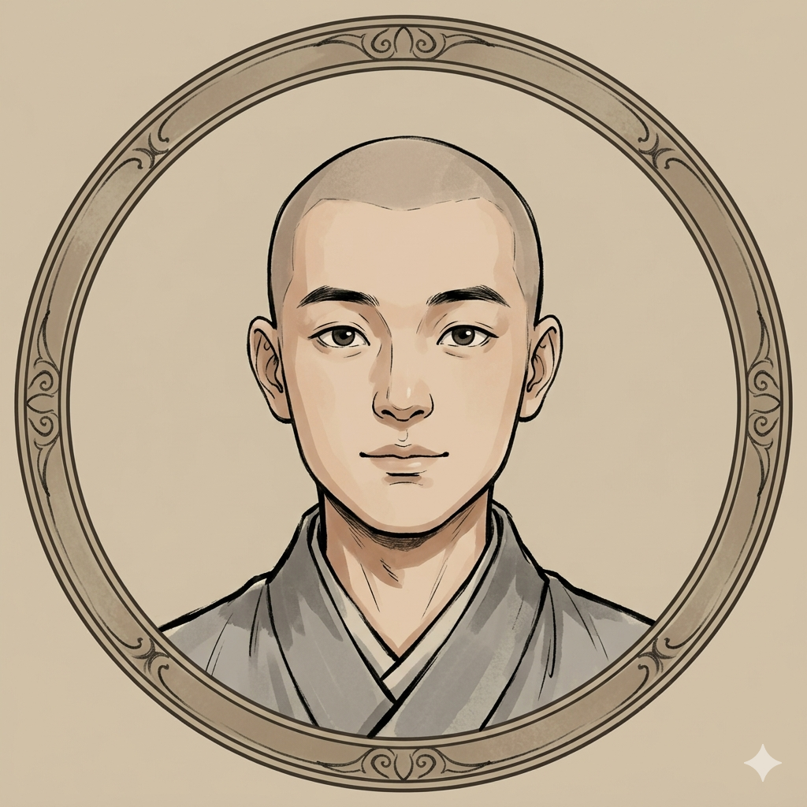

**出自**：《天龙八部》

| 属性 | 值 |
|------|-----|
| 体力 | 60 |
| 内力 | 28 |
| 轻功 | 10 |

**武功一：天山折梅手**
- 武功招式：天山折梅手（空手，消耗3内力，造成7点伤害，可追击一次）
- 内功：无

**武功二：天山六阳掌**
- 武功招式：天山六阳掌（空手，消耗4内力，造成8点伤害）
- 内功：无

**武功三：生死符**
- 武功招式：生死符（任意，消耗3内力，对方每回合失去3点体力，持续3回合）
- 内功：无

**武功四：北冥神功**
- 武功招式：无
- 内功：北冥神功（造成伤害时恢复等量内力的30%）

**卡组**（20张）：
- 拳击×5, 掌击×5, 肘击×4
- 刺击×2, 前踢×2, 扫腿×2

---

### 4. 郭靖 - 北侠
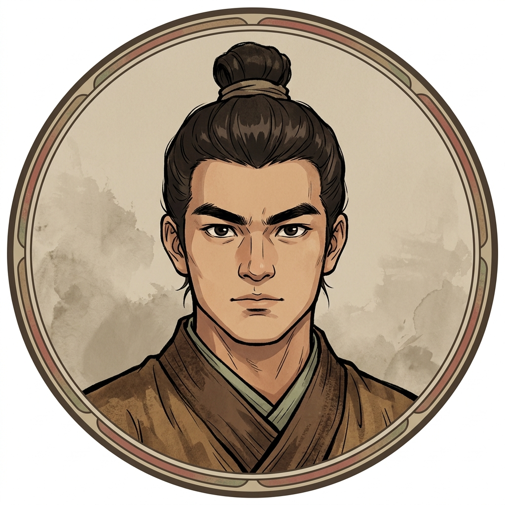

**出自**：《射雕英雄传》《神雕侠侣》

| 属性 | 值 |
|------|-----|
| 体力 | 68 |
| 内力 | 22 |
| 轻功 | 9 |

**武功一：降龙掌**
- 武功招式：降龙十八掌（空手，消耗4内力，造成10点伤害）
- 内功：无

**武功二：九阴真经**
- 武功招式：无
- 内功：九阴真经（武功招式内力消耗-1，每回合恢复2点内力）

**武功三：空明拳**
- 武功招式：空明拳（空手，消耗2内力，造成5点伤害，获得3点护盾）
- 内功：无

**卡组**（20张）：
- 拳击×5, 掌击×5, 肘击×4
- 前踢×3, 扫腿×3

---

### 5. 黄蓉 - 丐帮帮主
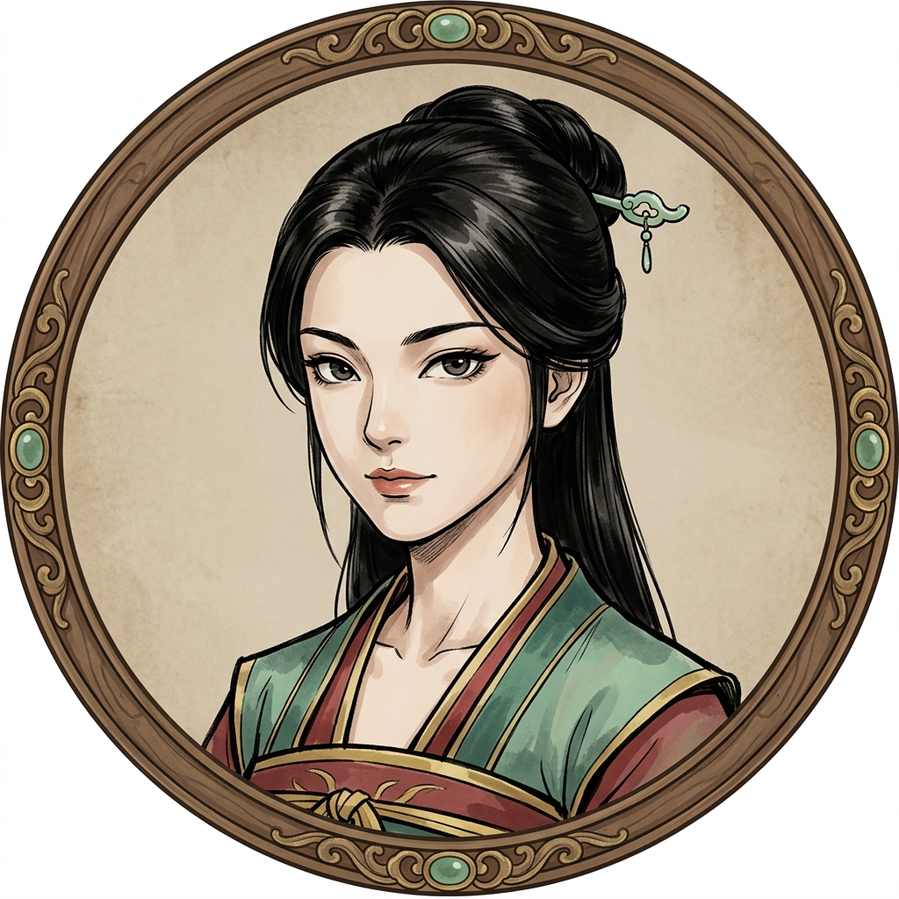

**出自**：《射雕英雄传》《神雕侠侣》

| 属性 | 值 |
|------|-----|
| 体力 | 52 |
| 内力 | 24 |
| 轻功 | 12 |

**武功一：打狗棒法**
- 武功招式：打狗棒法（长兵，消耗4内力，造成7点伤害，对方下回合无法使用腿法）
- 内功：无

**武功二：兰花拂穴手**
- 武功招式：兰花拂穴手（空手，消耗2内力，造成4点伤害，对方下回合轻功-3）
- 内功：无

**卡组**（20张）：
- 拳击×4, 掌击×4, 肘击×2
- 横扫×5, 直刺×3
- 前踢×2

---

### 6. 洪七公 - 北丐
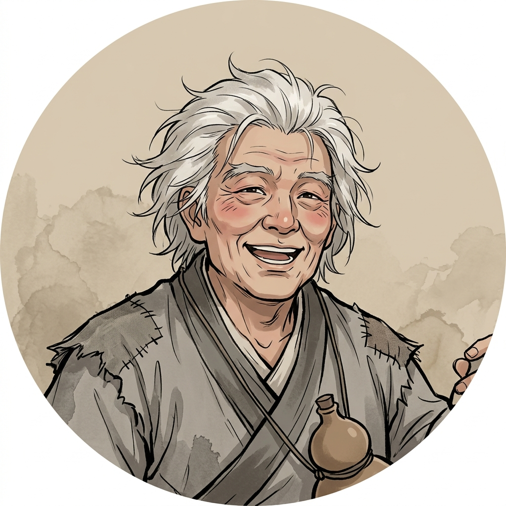

**出自**：《射雕英雄传》

| 属性 | 值 |
|------|-----|
| 体力 | 65 |
| 内力 | 22 |
| 轻功 | 10 |

**武功一：降龙掌**
- 武功招式：降龙十八掌（空手，消耗4内力，造成10点伤害）
- 内功：无

**武功二：打狗棒法**
- 武功招式：打狗棒法（长兵，消耗4内力，造成7点伤害，对方下回合无法使用腿法）
- 内功：无

**卡组**（20张）：
- 拳击×5, 掌击×5, 肘击×4
- 横扫×4, 直刺×2

---

### 7. 欧阳锋 - 西毒
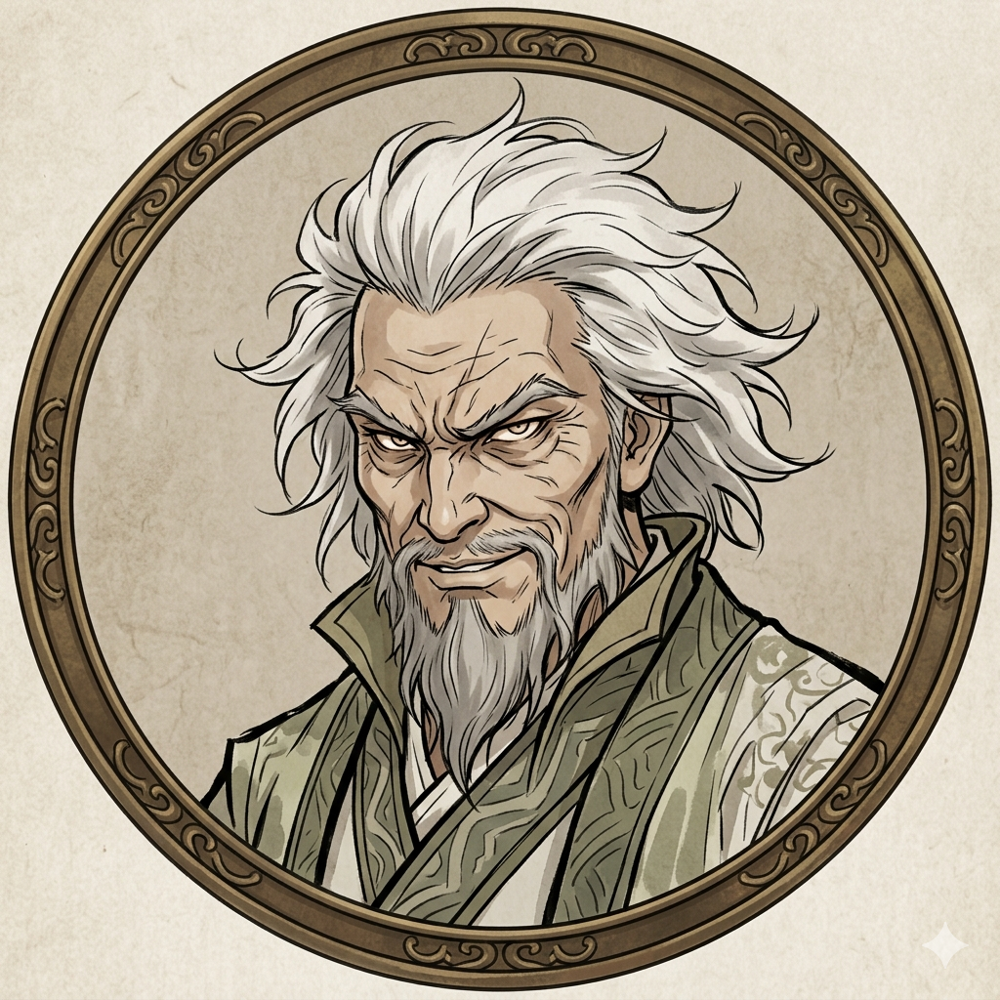

**出自**：《射雕英雄传》

| 属性 | 值 |
|------|-----|
| 体力 | 62 |
| 内力 | 24 |
| 轻功 | 9 |

**武功：蛤蟆功**
- 武功招式：蛤蟆功（空手，消耗5内力，造成12点伤害，需蓄力一回合）
- 内功：蛤蟆功（每回合开始获得3点护盾，蓄力期间双倍）

**卡组**（20张）：
- 拳击×5, 掌击×5, 肘击×6
- 前踢×2, 扫腿×2

---

### 8. 黄药师 - 东邪
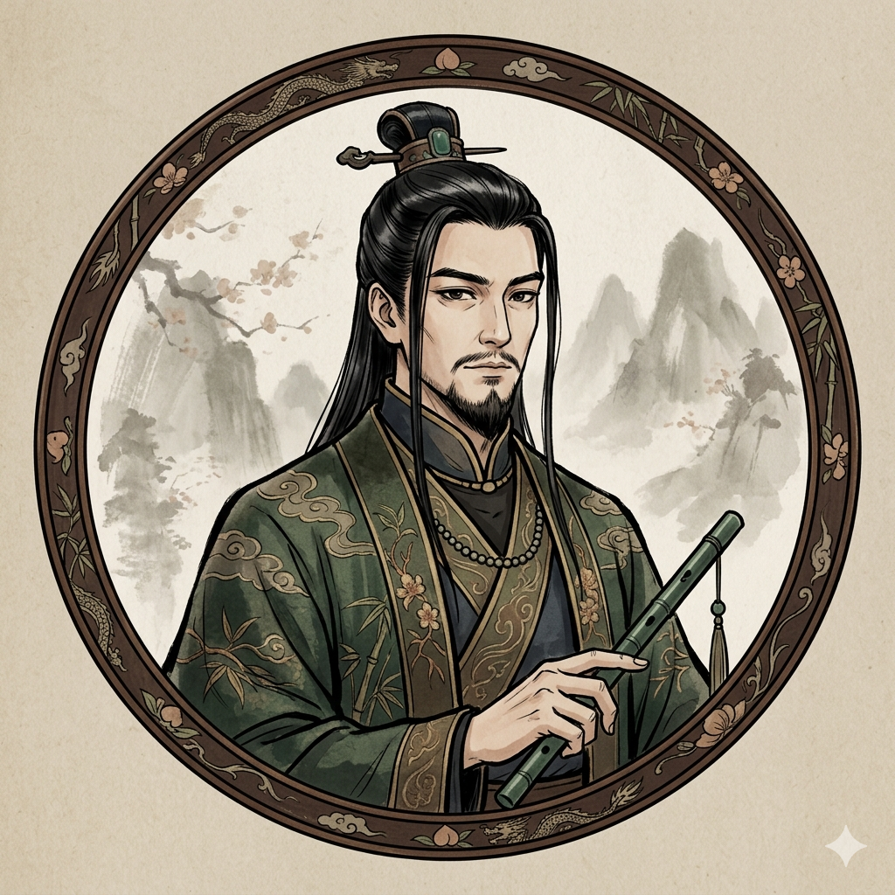

**出自**：《射雕英雄传》

| 属性 | 值 |
|------|-----|
| 体力 | 55 |
| 内力 | 26 |
| 轻功 | 12 |

**武功一：弹指神通**
- 武功招式：弹指神通（空手，消耗2内力，造成5点伤害，无视护盾）
- 内功：无

**武功二：落英神剑掌**
- 武功招式：落英神剑掌（空手，消耗3内力，造成6点伤害×2）
- 内功：无

**武功三：碧海潮生曲**
- 武功招式：碧海潮生曲（任意，消耗4内力，对方下回合轻功-5，无法使用武功招式）
- 内功：无

**卡组**（20张）：
- 拳击×4, 掌击×4, 肘击×3
- 刺击×3, 挥砍×3
- 前踢×2, 扫腿×1

---

### 9. 一灯大师 - 南帝
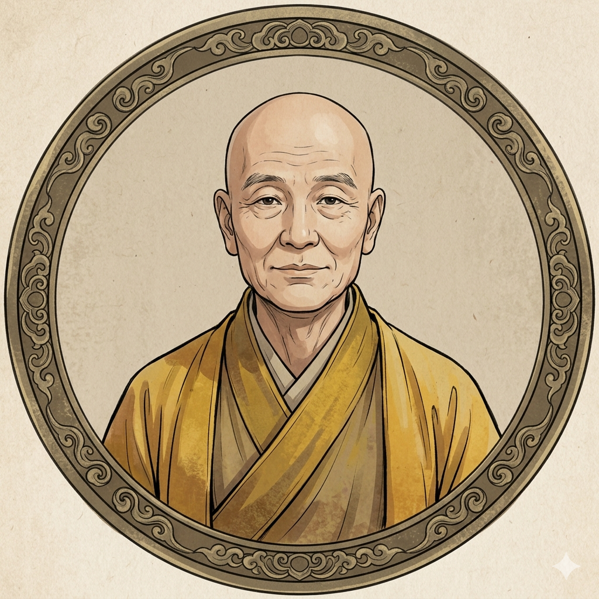

**出自**：《射雕英雄传》

| 属性 | 值 |
|------|-----|
| 体力 | 60 |
| 内力 | 28 |
| 轻功 | 8 |

**武功：一阳指**
- 武功招式：一阳指（空手，消耗3内力，造成8点伤害，无视护盾）
- 内功：先天功（武功招式伤害+25%，每回合恢复2点内力）

**卡组**（20张）：
- 拳击×6, 掌击×6, 肘击×4
- 前踢×2, 扫腿×2

---

### 10. 杨过 - 神雕大侠
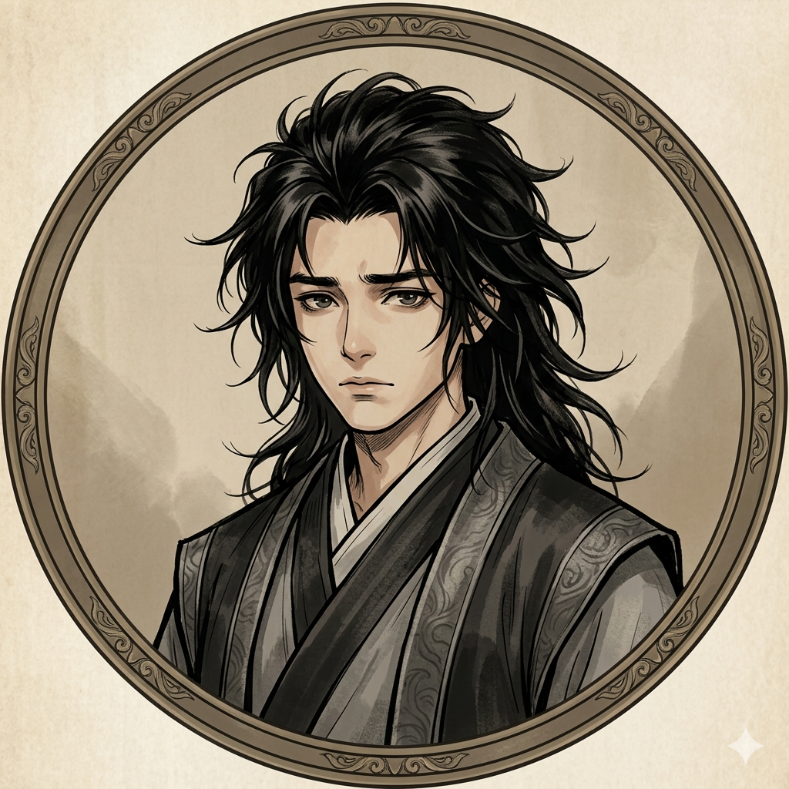

**出自**：《神雕侠侣》

| 属性 | 值 |
|------|-----|
| 体力 | 62 |
| 内力 | 22 |
| 轻功 | 11 |

**武功一：黯然销魂掌**
- 武功招式：黯然销魂掌（空手，消耗5内力，造成11点伤害，体力低于50%时伤害+50%）
- 内功：无

**武功二：玄铁剑法**
- 武功招式：玄铁剑法（长兵，消耗4内力，造成9点伤害，无视护盾）
- 内功：无

**武功三：九阴真经（部分）**
- 武功招式：无
- 内功：九阴真经（每回合恢复2点内力）

**卡组**（20张）：
- 拳击×4, 掌击×4, 肘击×3
- 横扫×4, 直刺×3
- 前踢×2

---

### 11. 小龙女 - 古墓派传人
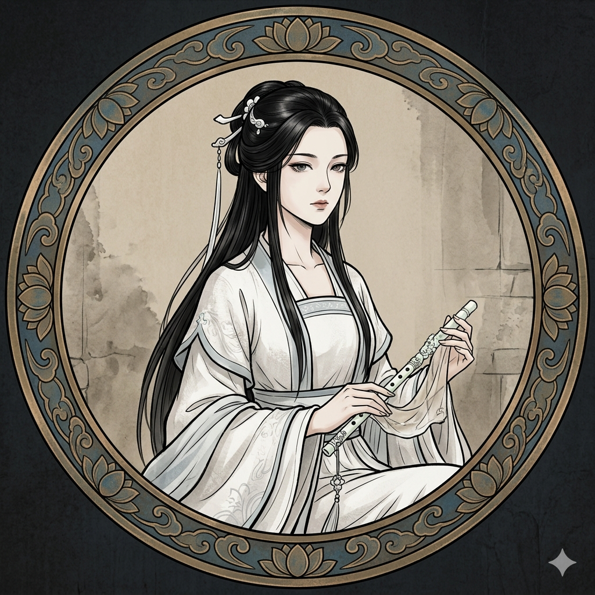

**出自**：《神雕侠侣》

| 属性 | 值 |
|------|-----|
| 体力 | 50 |
| 内力 | 24 |
| 轻功 | 13 |

**武功一：玉女剑法**
- 武功招式：玉女剑法（短兵，消耗3内力，造成7点伤害）
- 内功：无

**武功二：玉女心经**
- 武功招式：无
- 内功：玉女心经（受到伤害减少20%，每回合恢复2点体力）

**武功三：双剑合璧**
- 武功招式：双剑合璧（短兵，消耗6内力，需要2张短兵牌，造成14点伤害）
- 内功：无

**卡组**（20张）：
- 刺击×8, 挥砍×6, 格挡×4
- 前踢×2

---

### 12. 金轮法王 - 蒙古国师
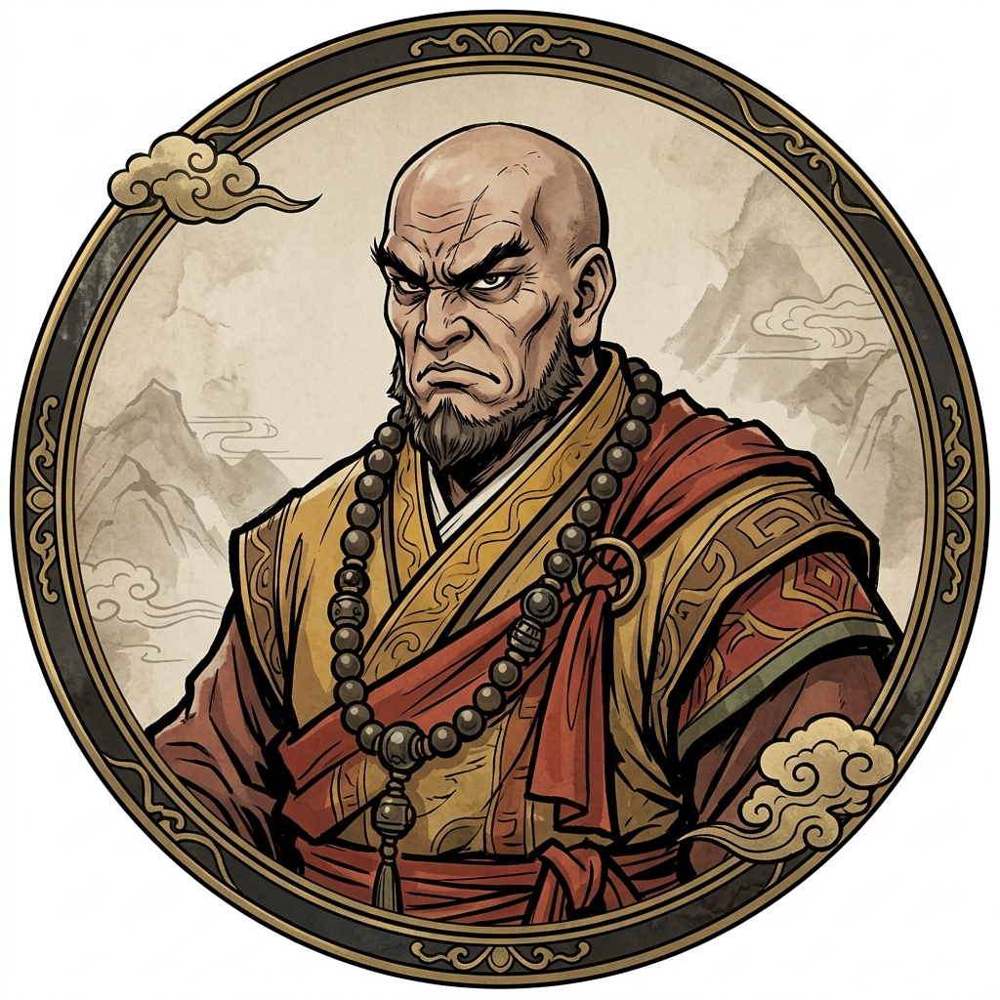

**出自**：《神雕侠侣》

| 属性 | 值 |
|------|-----|
| 体力 | 68 |
| 内力 | 24 |
| 轻功 | 8 |

**武功：龙象般若功**
- 武功招式：龙象般若功（空手，消耗5内力，造成12点伤害）
- 内功：龙象般若功（基础招式伤害+3，武功招式伤害+15%）

**卡组**（20张）：
- 拳击×5, 掌击×5, 肘击×6
- 前踢×2, 扫腿×2

---

### 13. 张无忌 - 明教教主
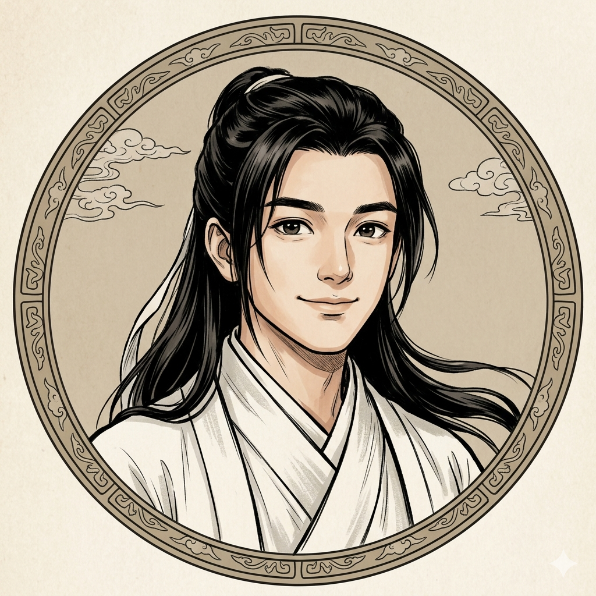

**出自**：《倚天屠龙记》

| 属性 | 值 |
|------|-----|
| 体力 | 58 |
| 内力 | 28 |
| 轻功 | 10 |

**武功一：九阳神功**
- 武功招式：无
- 内功：九阳神功（每回合恢复4点体力，受到伤害减少15%）

**武功二：乾坤大挪移**
- 武功招式：乾坤大挪移（任意，消耗4内力，造成8点伤害，获得5点护盾）
- 内功：乾坤大挪移（20%几率反弹受到的伤害）

**武功三：太极拳**
- 武功招式：太极拳（空手，消耗2内力，造成5点伤害，获得4点护盾）
- 内功：无

**卡组**（20张）：
- 拳击×6, 掌击×6, 肘击×4
- 前踢×2, 扫腿×2

---

### 14. 张三丰 - 武当祖师
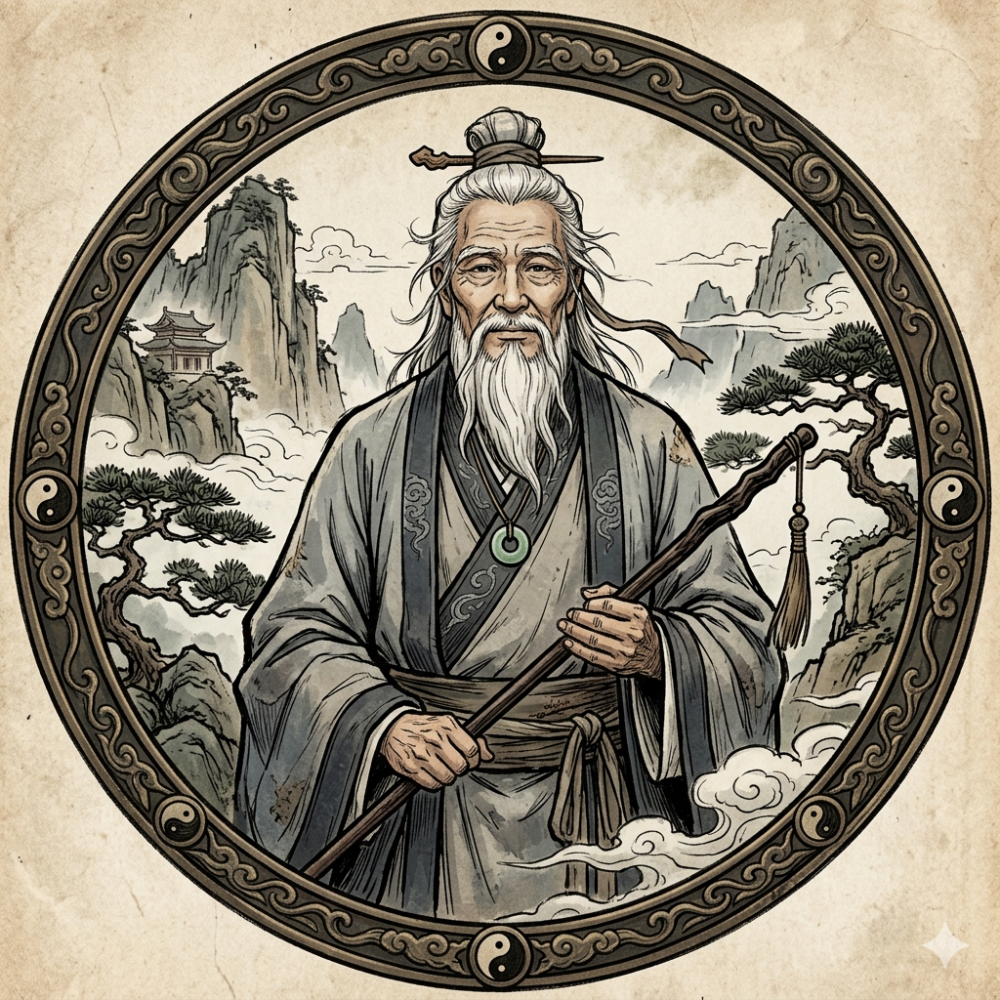

**出自**：《倚天屠龙记》

| 属性 | 值 |
|------|-----|
| 体力 | 60 |
| 内力 | 30 |
| 轻功 | 10 |

**武功一：太极拳**
- 武功招式：太极拳（空手，消耗2内力，造成5点伤害，获得4点护盾）
- 内功：无

**武功二：太极剑**
- 武功招式：太极剑（短兵，消耗3内力，造成6点伤害，获得3点护盾）
- 内功：无

**武功三：纯阳无极功**
- 武功招式：无
- 内功：纯阳无极功（每回合恢复3点内力，武功招式伤害+20%）

**卡组**（20张）：
- 拳击×4, 掌击×5, 肘击×3
- 刺击×4, 挥砍×2
- 前踢×2

---

### 15. 谢逊 - 金毛狮王
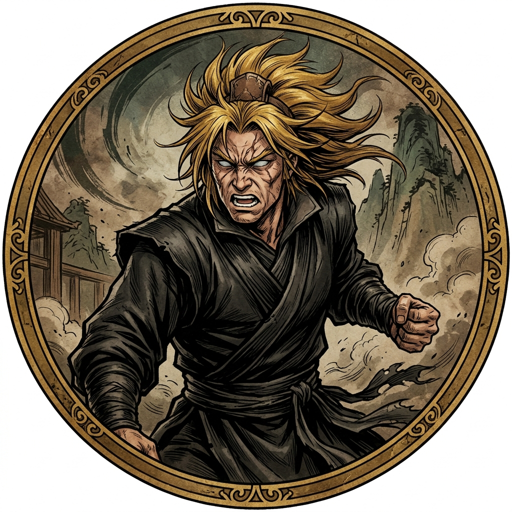

**出自**：《倚天屠龙记》

| 属性 | 值 |
|------|-----|
| 体力 | 65 |
| 内力 | 20 |
| 轻功 | 9 |

**武功一：七伤拳**
- 武功招式：七伤拳（空手，消耗3内力，造成8点伤害，自身失去2点体力）
- 内功：无

**武功二：狮子吼**
- 武功招式：狮子吼（任意，消耗4内力，对方下回合无法使用武功招式，轻功-3）
- 内功：无

**卡组**（20张）：
- 拳击×6, 掌击×5, 肘击×5
- 前踢×2, 扫腿×2

---

### 16. 令狐冲 - 华山弟子
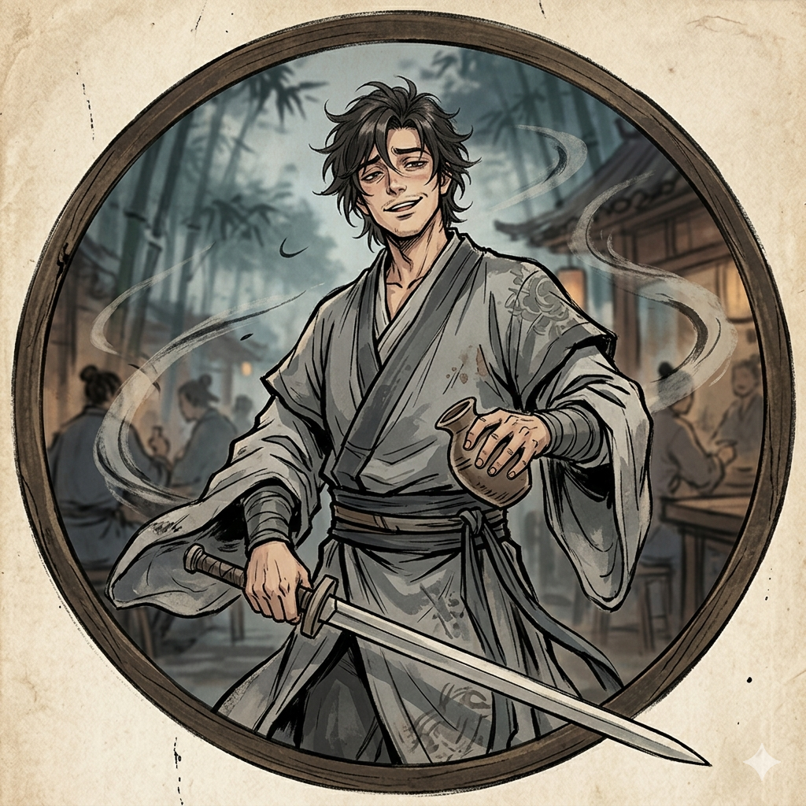

**出自**：《笑傲江湖》

| 属性 | 值 |
|------|-----|
| 体力 | 52 |
| 内力 | 20 |
| 轻功 | 12 |

**武功一：独孤九剑**
- 武功招式：独孤九剑（短兵，消耗4内力，造成9点伤害，无视护盾）
- 内功：无

**武功二：吸星大法**
- 武功招式：吸星大法（任意，消耗0内力，吸取对方5点内力）
- 内功：无

**武功三：易筋经**
- 武功招式：无
- 内功：易筋经（每回合恢复3点内力，净化一个负面状态）

**卡组**（20张）：
- 刺击×6, 挥砍×6, 格挡×4
- 前踢×2, 扫腿×2

---

### 17. 任我行 - 日月神教教主
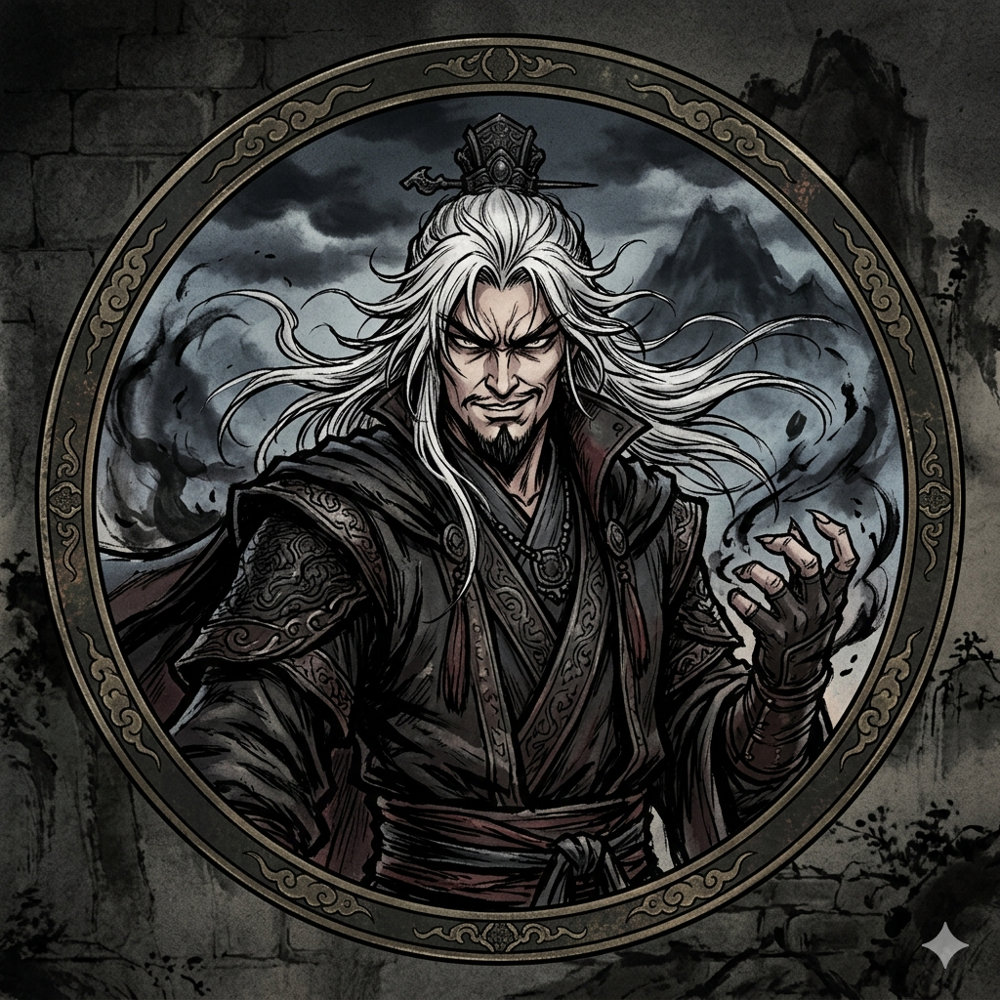

**出自**：《笑傲江湖》

| 属性 | 值 |
|------|-----|
| 体力 | 58 |
| 内力 | 26 |
| 轻功 | 10 |

**武功：吸星大法**
- 武功招式：吸星大法（任意，消耗0内力，吸取对方6点内力）
- 内功：吸星大法（造成伤害时恢复等量体力的40%）

**卡组**（20张）：
- 拳击×3, 掌击×3, 肘击×2
- 刺击×4, 挥砍×3
- 前踢×3, 扫腿×2

---

### 18. 东方不败 - 日月神教前教主
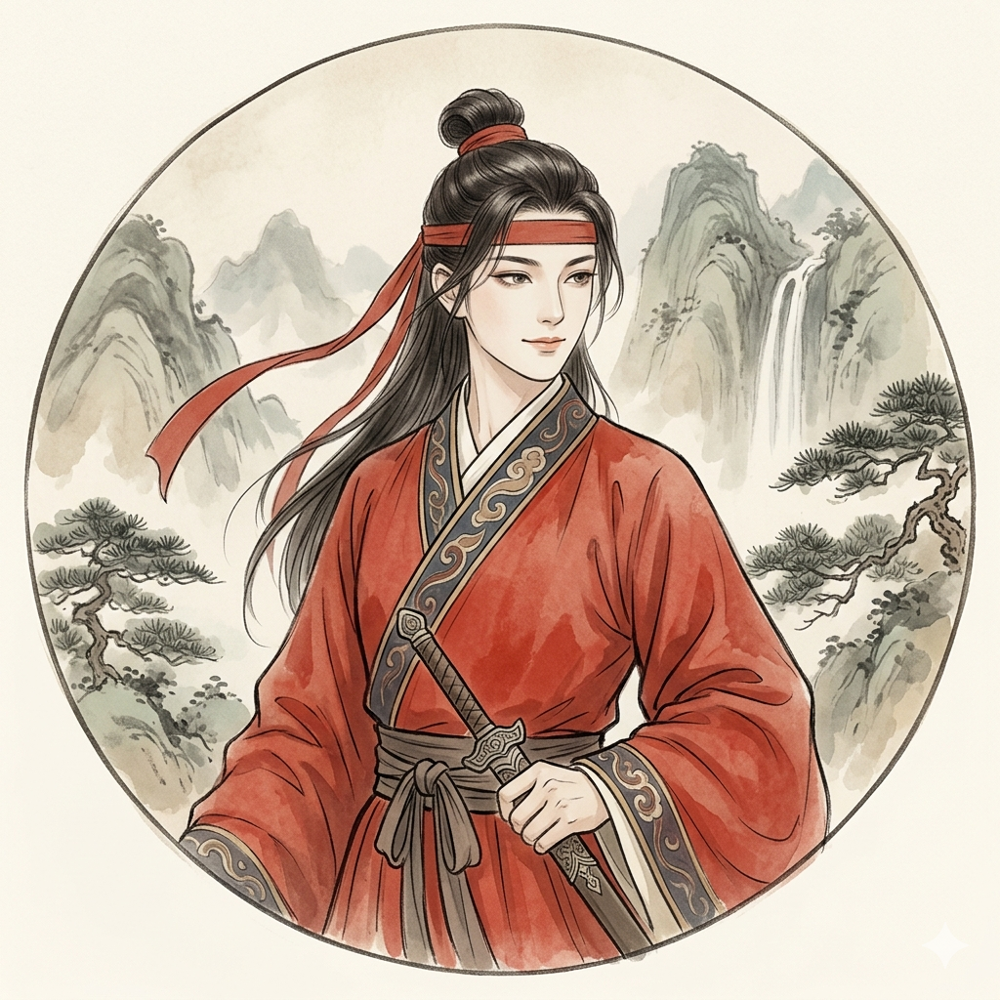

**出自**：《笑傲江湖》

| 属性 | 值 |
|------|-----|
| 体力 | 48 |
| 内力 | 22 |
| 轻功 | 16 |

**武功：葵花宝典**
- 武功招式：葵花宝典（短兵，消耗3内力，造成7点伤害，可再行动一次）
- 内功：葵花宝典（每回合轻功+2，30%几率闪避攻击）

**卡组**（20张）：
- 刺击×8, 挥砍×6, 格挡×4
- 前踢×2

---

### 19. 风清扬 - 华山剑宗
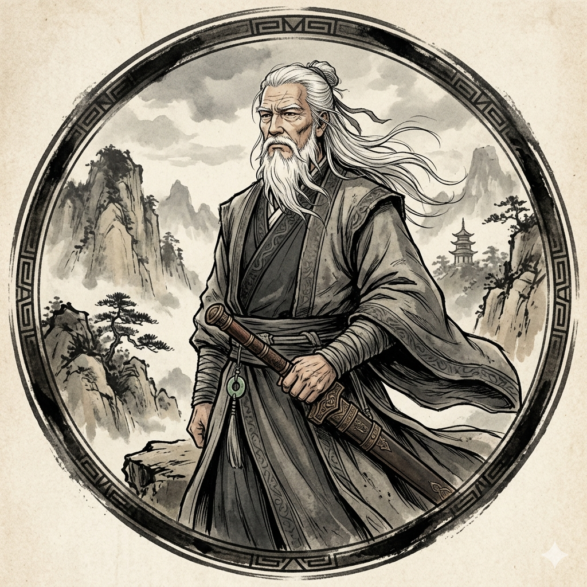

**出自**：《笑傲江湖》

| 属性 | 值 |
|------|-----|
| 体力 | 55 |
| 内力 | 24 |
| 轻功 | 11 |

**武功：独孤九剑**
- 武功招式：独孤九剑（短兵，消耗4内力，造成9点伤害，无视护盾）
- 内功：无

**卡组**（20张）：
- 刺击×8, 挥砍×6, 格挡×4
- 前踢×2

---

### 20. 鸠摩智 - 吐蕃国师
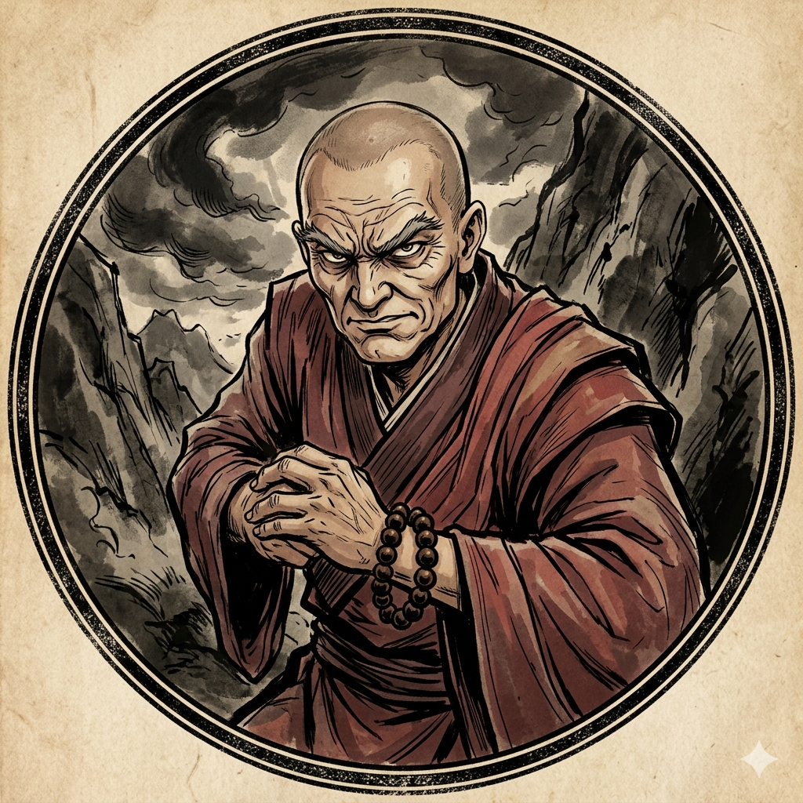

**出自**：《天龙八部》

| 属性 | 值 |
|------|-----|
| 体力 | 58 |
| 内力 | 26 |
| 轻功 | 10 |

**武功一：火焰刀**
- 武功招式：火焰刀（空手，消耗4内力，造成9点伤害，无视护盾）
- 内功：无

**武功二：小无相功**
- 武功招式：小无相功（任意，消耗2内力，模仿对方上次使用的武功招式）
- 内功：无

**卡组**（20张）：
- 拳击×5, 掌击×5, 肘击×4
- 刺击×2, 挥砍×2
- 前踢×2

---

### 21. 慕容复 - 姑苏慕容
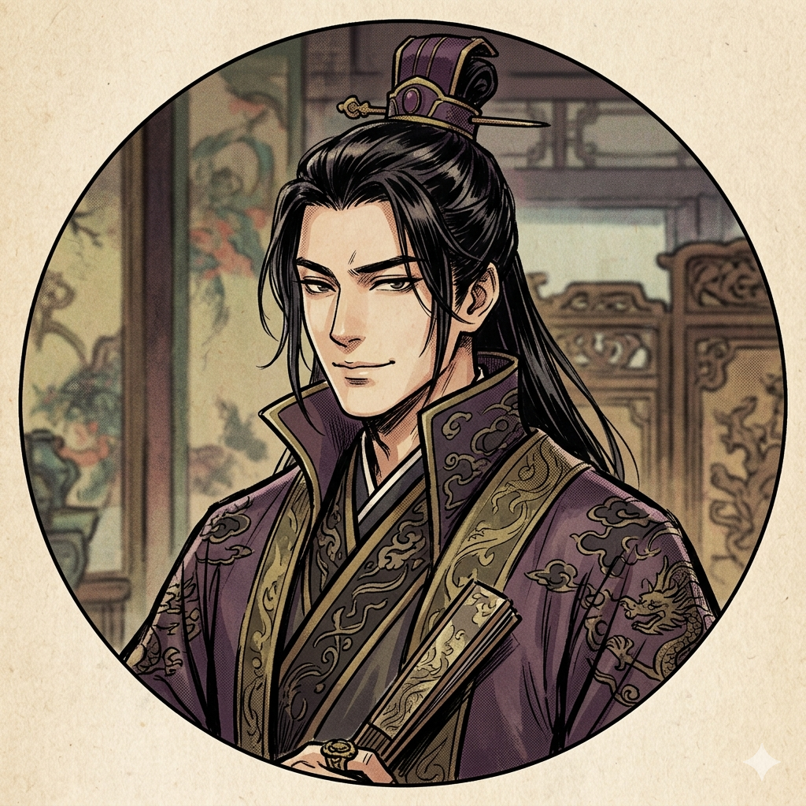

**出自**：《天龙八部》

| 属性 | 值 |
|------|-----|
| 体力 | 55 |
| 内力 | 24 |
| 轻功 | 11 |

**武功：斗转星移**
- 武功招式：斗转星移（任意，消耗3内力，反弹对方上次造成的伤害）
- 内功：斗转星移（25%几率反弹受到的伤害）

**卡组**（20张）：
- 拳击×3, 掌击×3, 肘击×2
- 刺击×3, 挥砍×3
- 横扫×2, 直刺×2
- 前踢×2

---

### 22. 袁承志 - 金蛇王
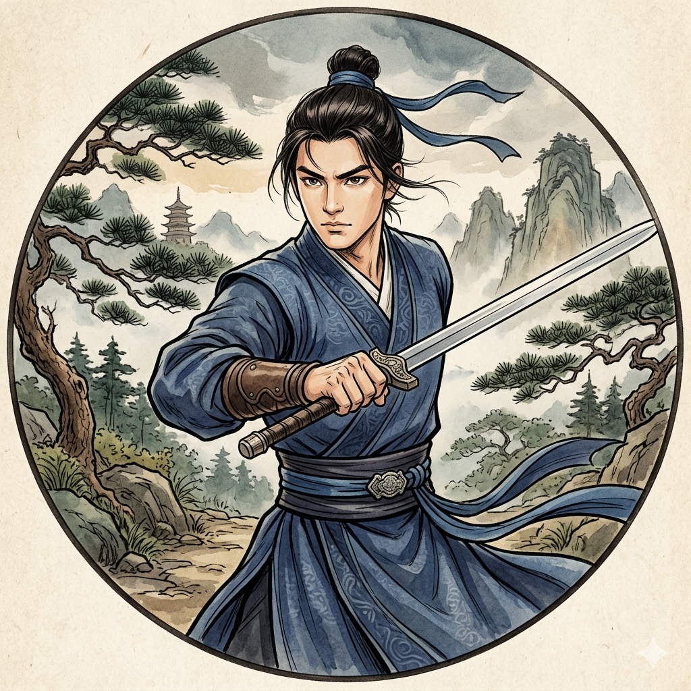

**出自**：《碧血剑》

| 属性 | 值 |
|------|-----|
| 体力 | 60 |
| 内力 | 22 |
| 轻功 | 11 |

**武功一：金蛇剑法**
- 武功招式：金蛇剑法（短兵，消耗3内力，造成7点伤害，对方下回合轻功-3）
- 内功：无

**武功二：金蛇锥**
- 武功招式：金蛇锥（短兵，消耗4内力，造成8点伤害，无视护盾）
- 内功：无

**卡组**（20张）：
- 刺击×7, 挥砍×5, 格挡×4
- 前踢×2, 扫腿×2

---

### 23. 狄云 - 连城诀主角

**出自**：《连城诀》

| 属性 | 值 |
|------|-----|
| 体力 | 62 |
| 内力 | 20 |
| 轻功 | 9 |

**武功：神照经**
- 武功招式：神照经掌（空手，消耗3内力，造成7点伤害，恢复自身3点体力）
- 内功：神照经（每回合恢复3点体力，体力低于20%时恢复效果翻倍）

**卡组**（20张）：
- 拳击×5, 掌击×5, 肘击×5
- 前踢×3, 扫腿×2

---

### 24. 石破天 - 侠客行主角
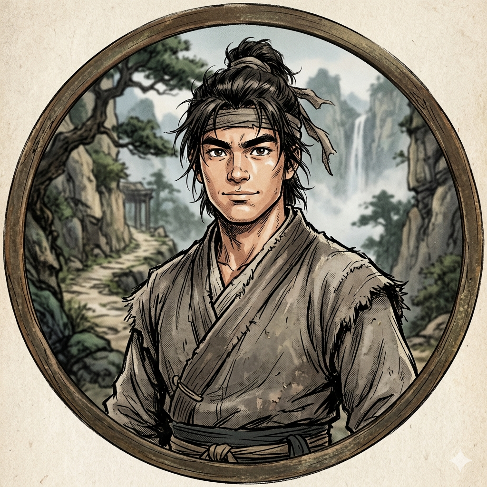

**出自**：《侠客行》

| 属性 | 值 |
|------|-----|
| 体力 | 70 |
| 内力 | 28 |
| 轻功 | 10 |

**武功：太玄经**
- 武功招式：太玄经（空手，消耗5内力，造成12点伤害）
- 内功：太玄经（每回合恢复4点体力，受到伤害减少20%）

**卡组**（20张）：
- 拳击×6, 掌击×6, 肘击×4
- 前踢×2, 扫腿×2

---

## 基础招式卡牌

### 空手类
| 招式名 | 基础效果 | 轻功消耗 |
|--------|----------|----------|
| 拳击 | 造成2点伤害 | 2 |
| 掌击 | 造成3点伤害 | 3 |
| 肘击 | 造成4点伤害，自身受1点反伤 | 4 |

### 短兵类
| 招式名 | 基础效果 | 轻功消耗 |
|--------|----------|----------|
| 刺击 | 造成3点伤害 | 2 |
| 挥砍 | 造成4点伤害 | 3 |
| 格挡 | 获得2点护盾 | 2 |

### 长兵类
| 招式名 | 基础效果 | 轻功消耗 |
|--------|----------|----------|
| 横扫 | 造成4点伤害 | 3 |
| 直刺 | 造成5点伤害 | 4 |
| 架势 | 获得3点护盾 | 3 |

### 腿法类
| 招式名 | 基础效果 | 轻功消耗 |
|--------|----------|----------|
| 前踢 | 造成3点伤害 | 2 |
| 扫腿 | 造成4点伤害 | 3 |
| 跃击 | 造成5点伤害 | 4 |