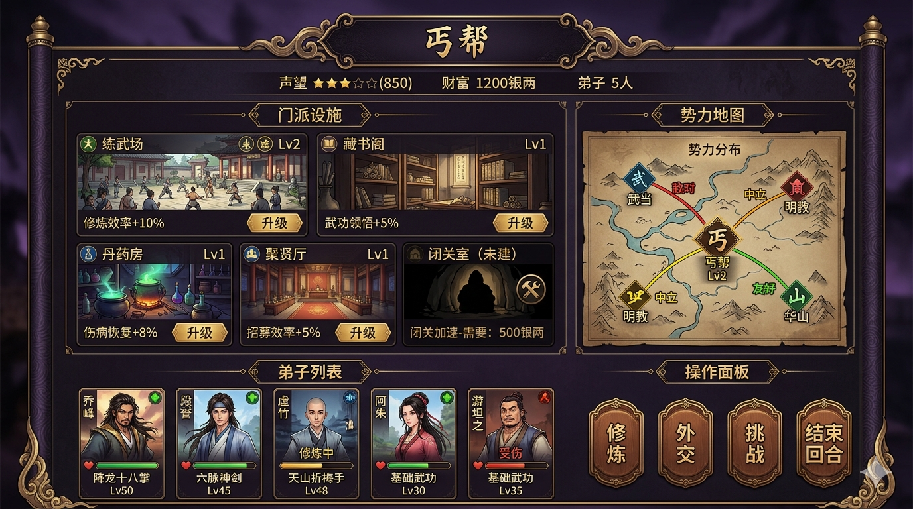
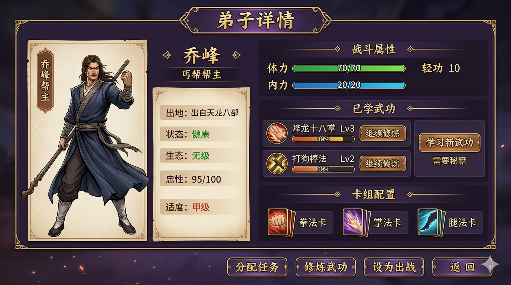
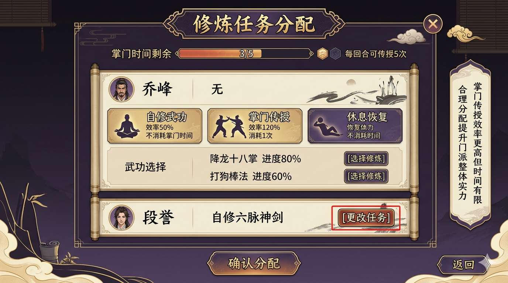
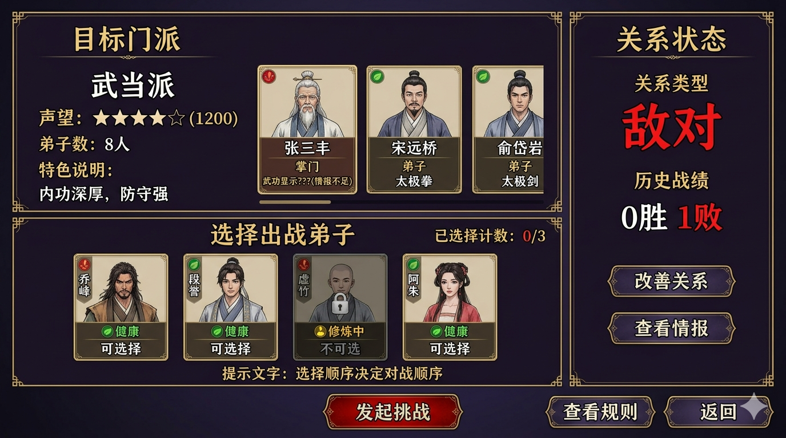
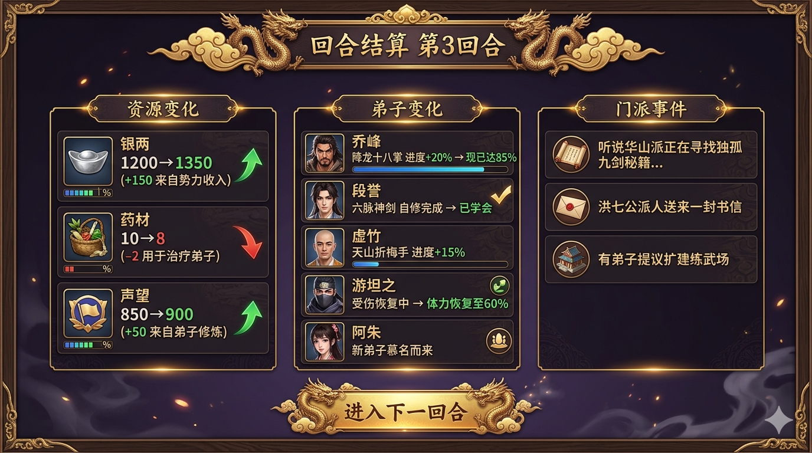
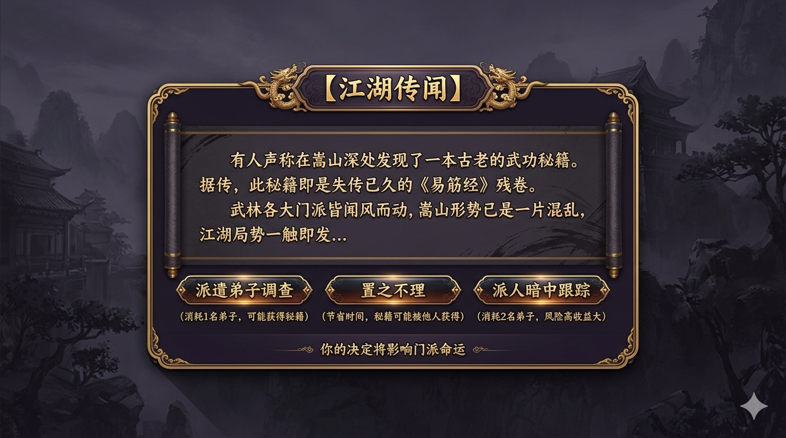
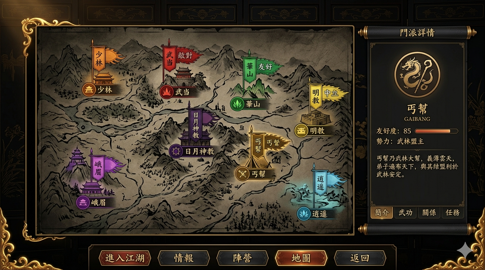

# 门派经营界面UI设计

## 设计原则

1. **与战斗界面风格统一**：继承现有配色（金色、红色、蓝色、深色背景）
2. **信息层级清晰**：门派状态 → 弟子列表 → 操作按钮
3. **响应式布局**：继承 `LayoutConstants` 的缩放机制
4. **最小化原型优先**：第一版只实现核心界面

---

## 一、门派主界面（战略视图）

### 1.1 布局草图



```
┌──────────────────────────────────────────────────────────────────────┐
│  ╔════════════════════════════════════════════════════════════════╗  │
│  ║                        【门派名称】丐帮                        ║  │
│  ║  声望: ★★★☆☆ (850)  │  财富: 1200银两  │  弟子: 5人  ║  │
│  ╚════════════════════════════════════════════════════════════════╝  │
│                                                                       │
│  ┌─────────────────────────────────────────┐  ┌────────────────────┐ │
│  │                                         │  │  【势力地图】      │ │
│  │           【门派设施区域】               │  │                    │ │
│  │                                         │  │  ┌────┐ ┌────┐    │ │
│  │   ┌─────────┐  ┌─────────┐  ┌─────────┐│  │  │丐帮│ │武当│    │ │
│  │   │练武场   │  │藏书阁   │  │丹药房   ││  │  │Lv2 │ │敌对│    │ │
│  │   │Lv.2     │  │Lv.1     │  │Lv.1     ││  │  └────┘ └────┘    │ │
│  │   │[弟子3]  │  │[秘籍2]  │  │[产出]   ││  │                    │ │
│  │   └─────────┘  └─────────┘  └─────────┘│  │  ┌────┐ ┌────┐    │ │
│  │                                         │  │  │明教│ │华山│    │ │
│  │   ┌─────────┐  ┌─────────┐             │  │  │中立│ │友好│    │ │
│  │   │聚贤厅   │  │闭关室   │             │  │  └────┘ └────┘    │ │
│  │   │Lv.1     │  │(未建)   │             │  │                    │ │
│  │   └─────────┘  └─────────┘             │  │  [点击查看详情]    │ │
│  │                                         │  └────────────────────┘ │
│  └─────────────────────────────────────────┘                          │
│                                                                       │
│  ┌──────────────────────────────────────────────────────────────────┐│
│  │                     【弟子列表】                                  ││
│  │  ┌────────┐ ┌────────┐ ┌────────┐ ┌────────┐ ┌────────┐        ││
│  │  │ 乔峰   │ │ 段誉   │ │ 虚竹   │ │ 阿朱   │ │ 游坦之 │        ││
│  │  │ ●健康  │ │ ●健康  │ │ ○修炼  │ │ ●健康  │ │ ○受伤  │        ││
│  │  │ 降龙掌 │ │ 六脉   │ │ 折梅手 │ │ 基础   │ │ 基础   │        ││
│  │  │ [详情] │ │ [详情] │ │ [详情] │ │ [详情] │ │ [详情] │        ││
│  │  └────────┘ └────────┘ └────────┘ └────────┘ └────────┘        ││
│  │                      [招募新弟子]                                ││
│  └──────────────────────────────────────────────────────────────────┘│
│                                                                       │
│  ┌──────────────┐  ┌──────────────┐  ┌──────────────┐  ┌──────────┐ │
│  │   【修炼】   │  │   【外交】   │  │   【挑战】   │  │ 【结束】  │ │
│  │  分配任务    │  │  门派互动    │  │  发起战斗    │  │  回合结算 │ │
│  └──────────────┘  ┌──────────────┘  ┌──────────────┘  └──────────┘ │
└──────────────────────────────────────────────────────────────────────┘
```

### 1.2 区域说明

| 区域 | 功能 | 交互 |
|------|------|------|
| **顶部状态栏** | 显示门派名称、声望、财富、弟子数 | 点击声望查看详情 |
| **设施区域** | 显示门派建筑及其状态 | 点击设施查看详情/升级 |
| **势力地图** | 显示其他门派位置及关系 | 点击门派查看详情/互动 |
| **弟子列表** | 显示所有弟子及状态 | 点击查看详情/分配任务 |
| **操作按钮** | 主要功能入口 | 点击进入对应界面 |

---

## 二、弟子详情界面

### 2.1 布局草图



```
┌──────────────────────────────────────────────────────────────────────┐
│  ╔════════════════════════════════════════════════════════════════╗  │
│  ║                        【弟子详情】                             ║  │
│  ╚════════════════════════════════════════════════════════════════╝  │
│                                                                       │
│  ┌──────────────────────────────────────────────────────────────────┐│
│  │                                                                  ││
│  │   ┌──────────────┐                                              ││
│  │   │   【头像】   │    姓名: 乔峰                                ││
│  │   │              │    称号: 丐帮帮主                            ││
│  │   │   (可使用    │    出自: 《天龙八部》                        ││
│  │   │   现有角色   │                                              ││
│  │   │   立绘)      │    状态: ● 健康                              ││
│  │   │              │    忠诚: 95/100                              ││
│  │   └──────────────┘    资质: 甲 (修炼效率 120%)                  ││
│  │                                                                  ││
│  │   ┌─────────────────────────────────────────────────────────┐   ││
│  │   │                    【战斗属性】                          │   ││
│  │   │   体力: 70/70  ████████████████████ 100%                │   ││
│  │   │   内力: 20/20  ████████████████████ 100%                │   ││
│  │   │   轻功: 10     ████████████████████                     │   ││
│  │   └─────────────────────────────────────────────────────────┘   ││
│  │                                                                  ││
│  │   ┌─────────────────────────────────────────────────────────┐   ││
│  │   │                    【已学武功】                          │   ││
│  │   │   ┌──────────────────┐ ┌──────────────────┐             │   ││
│  │   │   │ 降龙十八掌 Lv.3  │ │ 打狗棒法 Lv.2    │             │   ││
│  │   │   │ ████████░░ 80%  │ │ ██████░░░░ 60%   │             │   ││
│  │   │   │ [继续修炼]       │ │ [继续修炼]       │             │   ││
│  │   │   └──────────────────┘ └──────────────────┘             │   ││
│  │   │                                                          │   ││
│  │   │   [学习新武功] ← 需要秘籍                                │   ││
│  │   └─────────────────────────────────────────────────────────┘   ││
│  │                                                                  ││
│  │   ┌─────────────────────────────────────────────────────────┐   ││
│  │   │                    【卡组配置】                          │   ││
│  │   │   空手: 拳击×5, 掌击×5, 肘击×4                           │   ││
│  │   │   长兵: 横扫×4, 直刺×2                                   │   ││
│  │   │   腿法: 前踢×2                                           │   ││
│  │   │   [查看详情]                                             │   ││
│  │   └─────────────────────────────────────────────────────────┘   ││
│  │                                                                  ││
│  └──────────────────────────────────────────────────────────────────┘│
│                                                                       │
│  ┌──────────────┐  ┌──────────────┐  ┌──────────────┐  ┌──────────┐ │
│  │ 【分配任务】 │  │ 【修炼武功】 │  │ 【设为出战】 │  │ 【返回】  │ │
│  │  安排活动    │  │  选择武功    │  │  参加战斗    │  │          │ │
│  └──────────────┘  ┌──────────────┘  ┌──────────────┘  └──────────┘ │
└──────────────────────────────────────────────────────────────────────┘
```

### 2.2 关键交互

| 按钮 | 功能 | 条件 |
|------|------|------|
| **分配任务** | 安排弟子修炼/休息/外出 | 状态为健康 |
| **修炼武功** | 选择要修炼的武功 | 有秘籍或已学会 |
| **设为出战** | 设为门派战出战弟子 | 状态为健康 |
| **返回** | 返回门派主界面 | 无 |

---

## 三、修炼分配界面

### 3.1 布局草图



```
┌──────────────────────────────────────────────────────────────────────┐
│  ║         掌门时间剩余: 3/5 (每回合可传授3次)                     ║  │
│  ╚════════════════════════════════════════════════════════════════╝  │
│                                                                       │
│  ┌──────────────────────────────────────────────────────────────────┐│
│  │                     【待分配弟子】                               ││
│  │                                                                  ││
│  │   ┌──────────────────────────────────────────────────────────┐  ││
│  │   │  弟子: 乔峰                                               │  ││
│  │   │  当前任务: 无                                             │  ││
│  │   │                                                          │  ││
│  │   │  可选任务:                                               │  ││
│  │   │  ┌────────────────┐ ┌────────────────┐ ┌──────────────┐ │  ││
│  │   │  │ 自修武功      │ │ 掌门传授      │ │ 休息恢复    │ │  ││
│  │   │  │ 效率: 50%    │ │ 效率: 120%   │ │ 恢复体力   │ │  ││
│  │   │  │ 不消耗时间  │ │ 消耗1次    │ │ 不消耗时间│ │  ││
│  │   │  │ [选择]      │ │ [选择]     │ │ [选择]   │ │  ││
│  │   │  └────────────────┘ └────────────────┘ └──────────────┘ │  ││
│  │   │                                                          │  ││
│  │   │  若选择修炼武功:                                         │  ││
│  │   │  ┌────────────────┐ ┌────────────────┐                  │  ││
│  │   │  │ 降龙十八掌    │ │ 打狗棒法    │                      │  ││
│  │   │  │ 进度: 80%    │ │ 进度: 60%   │                      │  ││
│  │   │  │ [选择修炼]   │ │ [选择修炼]  │                      │  ││
│  │   │  └────────────────┘ └────────────────┘                  │  ││
│  │   └──────────────────────────────────────────────────────────┘  ││
│  │                                                                  ││
│  │   ┌──────────────────────────────────────────────────────────┐  ││
│  │   │  弟子: 段誉                                               │  ││
│  │   │  当前任务: 自修六脉神剑                                   │  ││
│  │   │  [更改任务]                                               │  ││
│  │   └──────────────────────────────────────────────────────────┘  ││
│  │                                                                  ││
│  └──────────────────────────────────────────────────────────────────┘│
│                                                                       │
│                              ┌──────────────┐  ┌──────────────┐       │
│                              │ 【确认分配】 │  │   【返回】   │       │
│                              └──────────────┘  └──────────────┘       │
└──────────────────────────────────────────────────────────────────────┘
```

---

## 四、门派挑战界面

### 4.1 布局草图



```
┌──────────────────────────────────────────────────────────────────────┐
│  ╔════════════════════════════════════════════════════════════════╗  │
│  ║                    【门派挑战】                                 ║  │
│  ╚════════════════════════════════════════════════════════════════╝  │
│                                                                       │
│  ┌─────────────────────────────────────────┐  ┌────────────────────┐ │
│  │         【目标门派信息】                 │  │  【关系状态】      │ │
│  │                                         │  │                    │ │
│  │   门派: 武当派                          │  │  当前关系: 敌对    │ │
│  │   声望: ★★★★☆ (1200)                  │  │  战绩: 0胜 1败    │ │
│  │   弟子数: 8                             │  │                    │ │
│  │   特色: 内功深厚，防守强                │  │  [改善关系]        │ │
│  │                                         │  │  [查看情报]        │ │
│  │   ┌─────────────────────────────────┐   │  └────────────────────┘ │
│  │   │      【敌方弟子预览】            │   │                          │
│  │   │  ┌────────┐ ┌────────┐        │   │                          │
│  │   │  │ 张三丰 │ │ 宋远桥 │        │   │                          │
│  │   │  │掌门    │ │弟子    │        │   │                          │
│  │   │  │???     │ │太极拳  │        │   │                          │
│  │   │  └────────┘ └────────┘        │   │                          │
│  │   │   (情报不足时显示??? )         │   │                          │
│  │   └─────────────────────────────────┘   │                          │
│  └─────────────────────────────────────────┘                          │
│                                                                       │
│  ┌──────────────────────────────────────────────────────────────────┐│
│  │                     【选择出战弟子】                              ││
│  │                                                                  ││
│  │   已选择: 0/3                                                    ││
│  │                                                                  ││
│  │   ┌────────┐ ┌────────┐ ┌────────┐ ┌────────┐ ┌────────┐       ││
│  │   │ 乔峰   │ │ 段誉   │ │ 虚竹   │ │ 阿朱   │ │ 游坦之 │       ││
│  │   │ ●健康  │ │ ●健康  │ │ ○修炼  │ │ ●健康  │ │ ○受伤  │       ││
│  │   │ [选择] │ │ [选择] │ │ [不可] │ │ [选择] │ │ [不可] │       ││
│  │   └────────┘ └────────┘ └────────┘ └────────┘ └────────┘       ││
│  │                                                                  ││
│  │   选择顺序将决定对战顺序                                         ││
│  │                                                                  ││
│  └──────────────────────────────────────────────────────────────────┘│
│                                                                       │
│  ┌──────────────┐  ┌──────────────┐  ┌──────────────┐               │
│  │ 【发起挑战】 │  │ 【查看规则】 │  │   【返回】   │               │
│  │  开始战斗    │  │  战斗说明    │  │              │               │
│  └──────────────┘  ┌──────────────┘  ┌──────────────┘               │
└──────────────────────────────────────────────────────────────────────┘
```

### 4.2 战斗流程

```
门派战流程:
┌────────────────────────────────────┐
│  1. 选择出战弟子 (最多3名)         │
│  2. 系统匹配敌方弟子               │
│  3. 弟子1 vs 敌方弟子1             │
│     → 进入卡牌战斗界面             │
│     → 返回胜负结果                 │
│  4. 弟子2 vs 敌方弟子2             │
│     → 进入卡牌战斗界面             │
│  5. 弟子3 vs 敌方弟子3             │
│     → 进入卡牌战斗界面             │
│  6. 统计胜负场次                   │
│     ├─ 胜2场以上: 门派战胜         │
│     ├─ 负2场以上: 门派战败         │
│     └─ 平局: 双方声望不变          │
│  7. 战后结算                       │
│     ├─ 胜利: 获得声望+100          │
│     │        可能获得秘籍/弟子     │
│     ├─ 失败: 损失声望-50           │
│     │        弟子受伤              │
│     └─ 若敌方声望远高于你:         │
│     │        可能被迫臣服          │
└────────────────────────────────────┘
```

---

## 五、回合结算界面

### 5.1 布局草图



```
┌──────────────────────────────────────────────────────────────────────┐
│  ╔════════════════════════════════════════════════════════════════╗  │
│  ║                    【回合结算】第 3 回合                        ║  │
│  ╚════════════════════════════════════════════════════════════════╝  │
│                                                                       │
│  ┌──────────────────────────────────────────────────────────────────┐│
│  │                     【本回合变化】                               ││
│  │                                                                  ││
│  │   ┌─────────────────────────────────────────────────────────┐   ││
│  │   │  资源变化                                                │   ││
│  │   │  ┌──────────────────────────────────────────────────┐   │   ││
│  │   │  │  银两:  1200 → 1350  (+150 来自势力收入)         │   │   ││
│  │   │  │  药材:    10 →    8  (-2 用于治疗弟子)           │   │   ││
│  │   │  │  声望:   850 →  900  (+50 来自弟子修炼)          │   │   ││
│  │   │  └──────────────────────────────────────────────────┘   │   ││
│  │   └─────────────────────────────────────────────────────────┘   ││
│  │                                                                  ││
│  │   ┌─────────────────────────────────────────────────────────┐   ││
│  │   │  弟子变化                                                │   ││
│  │   │  ┌──────────────────────────────────────────────────┐   │   ││
│  │   │  │  乔峰: 降龙十八掌 进度+20% → 现已达85%            │   │   ││
│  │   │  │  段誉: 六脉神剑 自修完成 → 已学会                 │   │   ││
│  │   │  │  虚竹: 天山折梅手 进度+15%                        │   │   ││
│  │   │  │  游坦之: 受伤恢复中 → 体力恢复至60%              │   │   ││
│  │   │  │  阿朱: 新弟子慕名而来                             │   │   ││
│  │   │  └──────────────────────────────────────────────────┘   │   ││
│  │   └─────────────────────────────────────────────────────────┘   ││
│  │                                                                  ││
│  │   ┌─────────────────────────────────────────────────────────┐   ││
│  │   │  门派事件                                                │   ││
│  │   │  ┌──────────────────────────────────────────────────┐   │   ││
│  │   │  │  ● 听说华山派正在寻找《独孤九剑》秘籍...         │   │   ││
│  │   │  │  ● 洪七公派人送来一封书信                         │   │   ││
│  │   │  │  ● 有弟子提议扩建练武场                           │   │   ││
│  │   │  └──────────────────────────────────────────────────┘   │   ││
│  │   └─────────────────────────────────────────────────────────┘   ││
│  │                                                                  ││
│  └──────────────────────────────────────────────────────────────────┘│
│                                                                       │
│                              ┌──────────────┐                        │
│                              │ 【进入下一回合】 │                     │
│                              └──────────────┘                        │
└──────────────────────────────────────────────────────────────────────┘
```

---

## 六、事件弹出界面

### 6.1 布局草图



```
┌──────────────────────────────────────────────────────────────────────┐
│                    │                                │                │
│                    │  有人声称在嵩山发现了          │                │
│                    │  一本古老的武功秘籍...         │                │
│                    │                                │                │
│                    │  ┌─────────────────────────┐   │                │
│                    │  │ [派遣弟子去调查]        │   │                │
│                    │  │ 消耗1名弟子本回合行动   │   │                │
│                    │  │ 可能获得秘籍            │   │                │
│                    │  └─────────────────────────┘   │                │
│                    │                                │                │
│                    │  ┌─────────────────────────┐   │                │
│                    │  │ [置之不理]              │   │                │
│                    │  │ 节省弟子时间            │   │                │
│                    │  │ 秘籍可能被他人获得      │   │                │
│                    │  └─────────────────────────┘   │                │
│                    │                                │                │
│                    └────────────────────────────────┘                │
│                                                                       │
└──────────────────────────────────────────────────────────────────────┘
```

---

## 七、势力地图界面

### 7.1 布局草图



势力地图界面显示整个江湖的势力分布，玩家可以：
- 查看各门派位置和关系状态
- 点击门派查看详细信息
- 进行外交互动或发起挑战

### 7.2 门派标注说明

| 颜色 | 关系状态 | 示例门派 |
|------|----------|----------|
| 金色 | 自己的门派 | 丐帮 |
| 绿色 | 友好 | 华山派 |
| 黄色 | 中立 | 明教、少林 |
| 红色 | 敌对 | 武当、日月神教 |

---

## 八、技术实现建议

### 8.1 新增组件类

继承现有 `UIComponents.ts` 风格：

```typescript
// 建议新增组件
SectorPanel        // 门派主界面面板
SectorStatusBar    // 门派状态栏
SectorFacility     // 设施卡片
SectorMap          // 势力地图
DiscipleCard       // 弟子卡片
DiscipleDetail     // 弟子详情面板
TrainingPanel      // 修炼分配面板
ChallengePanel     // 门派挑战面板
TurnSummary        // 回合结算面板
EventPopup         // 事件弹出框
```

### 8.2 场景结构

```
新增场景:
src/scenes/SectorScene.ts         // 门派主界面场景
src/scenes/DiscipleScene.ts       // 弟子管理场景
src/scenes/ChallengeScene.ts      // 门派挑战场景
src/scenes/TurnSummaryScene.ts    // 回合结算场景

场景切换:
TitleScene → SectorScene → ChallengeScene → BattleScene
                   ↓
              DiscipleScene
                   ↓
              TurnSummaryScene → SectorScene (循环)
```

### 8.3 响应式布局参数

新增到 `LayoutConstants.ts`：

```typescript
// 门派界面尺寸
sectorPanelWidth()    // 门派主面板宽度
sectorPanelHeight()   // 门派主面板高度
facilityWidth()       // 设施卡片宽度
facilityHeight()      // 设施卡片高度
discipleCardWidth()   // 弟子卡片宽度
discipleCardHeight()  // 弟子卡片高度
mapWidth()            // 势力地图宽度
mapHeight()           // 势力地图高度
```

---

## 九、最小原型范围

### 第一版实现内容

| 界面 | 实现程度 |
|------|----------|
| **门派主界面** | 基础版本：状态栏 + 弟子列表 + 三个按钮 |
| **弟子详情** | 基础版本：显示属性 + 修炼按钮 |
| **门派挑战** | 基础版本：选择弟子 → 进入战斗 |
| **回合结算** | 基础版本：显示资源变化 |

### 第一版省略内容

- 势力地图可视化
- 设施建设/升级
- 事件系统
- 外交系统
- 弟子招募动画

### 第一版数据结构

```typescript
// 最小门派数据
interface Sector {
  name: string
  reputation: number
  wealth: number
  disciples: Disciple[]
  facilities: Facility[]  // 简化版
}

interface Disciple {
  id: string
  characterData: Character  // 复用现有角色数据
  loyalty: number
  status: 'healthy' | 'training' | 'injured'
  trainingTask?: TrainingTask
}

interface TrainingTask {
  martialArtId: string
  progress: number  // 0-100
  method: 'self' | 'master'  // 自修/掌门传授
}
```

---

## 十、配色继承

继承现有 `Renderer.ts` 配色：

| 用途 | 颜色值 | 来源 |
|------|--------|------|
| 背景 | `Colors.PANEL_BG` | 现有 |
| 金色文字 | `Colors.TEXT_GOLD` | 现有 |
| 红色(玩家) | `Colors.TEXT_RED` | 现有 |
| 蓝色(敌方) | `Colors.TEXT_BLUE` | 现有 |
| 边框 | `Colors.TEXT_SECONDARY` | 现有 |
| 按钮 | `Colors.BUTTON_*` | 现有 |

---

## 十一、交互流程图

```
游戏流程:
┌────────────────────────────────────────────────────────┐
│                                                        │
│  TitleScene                                            │
│     │                                                  │
│     ▼                                                  │
│  SectorScene (门派主界面)                              │
│     │                                                  │
│     ├─→ [修炼] → TrainingPanel → 返回                 │
│     │                                                  │
│     ├─→ [弟子详情] → DiscipleScene → 返回              │
│     │                                                  │
│     ├─→ [挑战] → ChallengeScene                        │
│     │                  │                               │
│     │                  ▼                               │
│     │              BattleScene (现有战斗系统)          │
│     │                  │                               │
│     │                  ▼                               │
│     │              ResultScene → 返回 SectorScene      │
│     │                                                  │
│     ├─→ [结束回合] → TurnSummaryScene                  │
│     │                  │                               │
│     │                  ▼                               │
│     │              SectorScene (下一回合)              │
│     │                                                  │
│     └──────────────────────────────────────────────────│
│                                                        │
└────────────────────────────────────────────────────────┘
```

---

## 十二、附录：参考图片风格

建议参考现有 `BattleScene` 的视觉风格：
- 深色半透明背景面板
- 金色边框和标题
- 红色/蓝色区分玩家/敌方
- 响应式文字大小
- 圆角矩形按钮